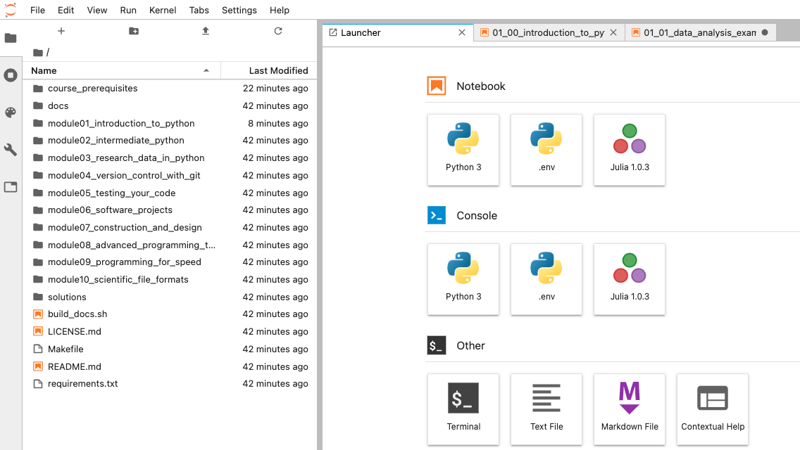

# Working with the Course Contents

After following the installation instructions for your operating system, you should now have the following:

1. A `Git` installation, linked to your `GitHub` account
2. A working installation of the `Python` (3) programming language
3. The `jupyter` package for `Python`

Throughout the course, we will be working in Python, and one of the best ways to hey started with this language is the Jupyter notebook.

In addition to viewing the course materials online at this site (https://alan-turing-institute.github.io/rse-course), we recommend cloning (downloading) the GitHub repository containing the course contents. This allows you to open the contents interactively via Jupyter on your computer.

Navigate to a suitable location in a terminal window and clone the course repository (if you haven't used Git/GitHub before, it can be useful to create a folder to store repositories with `mkdir`):

```bash
mkdir ~/github_repos
cd ~/github_repos
git clone https://github.com/alan-turing-institute/rse-course
```

The course contents should take a few moments to download. Once the download has finished, enter the repository and launch Jupyter:

```bash
cd rse-course
jupyter lab
```

This should automatically open a window in your default web browser (if not, go to http://localhost:8890/lab).

You should be able to see a layout that looks something like the below. Double clicking on the folders, then the `.ipynb` files within will allow you to view the course materials interactively, giving you the option to edit code cells and experiment as you learn.


 