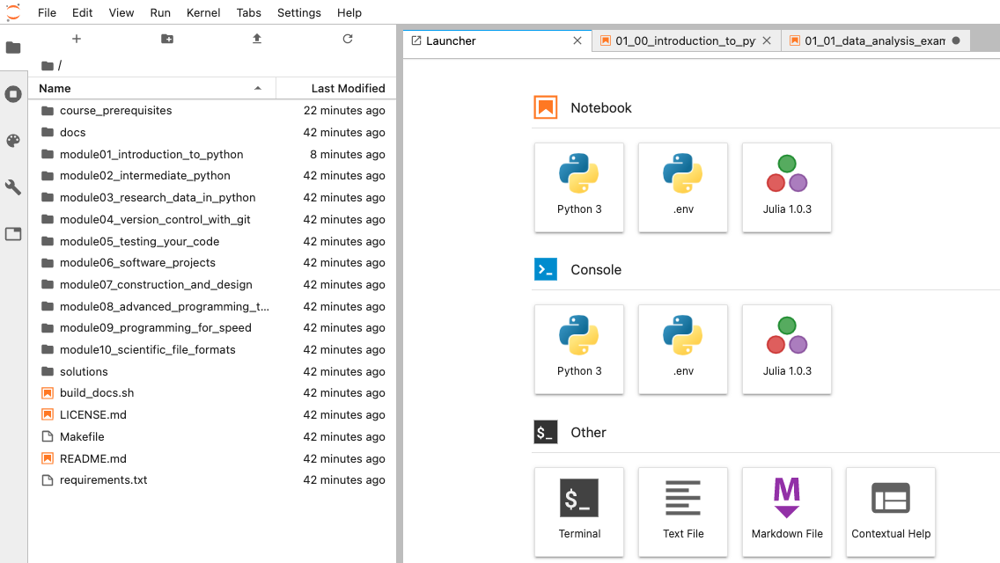

# Jupyter

After following the installation instructions for your operating system, you should now have the following:

1. A `Git` installation, linked to your `GitHub` account
2. A working installation of the `Python` (3) programming language
3. The ability to install Python packages via `Conda`

Throughout the course, we will be working in Python, and one of the best ways to get started with this language is Jupyter Lab.

In addition to viewing the course materials online at this site (https://alan-turing-institute.github.io/rse-course), we recommend cloning (downloading) the GitHub repository containing the course contents. This allows you to open the contents interactively via Jupyter on your computer.

Navigate to a suitable location in a terminal window and clone the course repository (if you haven't used Git/GitHub before, it can be useful to create a folder to store repositories with `mkdir`):

```bash
mkdir ~/github_repos
cd ~/github_repos
git clone https://github.com/alan-turing-institute/rse-course
```

The course contents should take a few moments to download. Once the download has finished, you should enter the cloned course repository, set up a `conda` Python environment containing the packages we'll make use of during the course (including Jupyter) and then launch Jupyter Lab. To do this, we'll make use of conda's `environment.yml` file, which is configured in this case to create an environment named `rse-course`:

```bash
cd rse-course
conda env create -f environment.yml
conda activate rse-course
jupyter lab
```

This should automatically open a window in your default web browser (if not, go to http://localhost:8890/lab).

You should be able to see a layout that looks something like the below. Double clicking on the folders, then the `.ipynb` files within will allow you to view the course materials interactively, giving you the option to edit code cells and experiment as you learn.



### Jupyter issues on Windows (Sophos):

To use the Jupyter Lab on a `Windows` computer with Sophos anti-virus installed it may be necessary to open additional ports allowing communication between the notebook and its server.
The [solution](http://stackoverflow.com/questions/13036197/ipython-notebook-getting-output) is:

- open your `Sophos Endpoint Security and Control Panel` from your tray or start menu
- Select `Configure > Anti-virus > Authorization` from the menu at the top
- Select the websites tab
- click the `Add` button and add `127.0.0.1` and `localhost` to the `Authorized websites` list
- restart computer (or just restart the Jupyter)
 